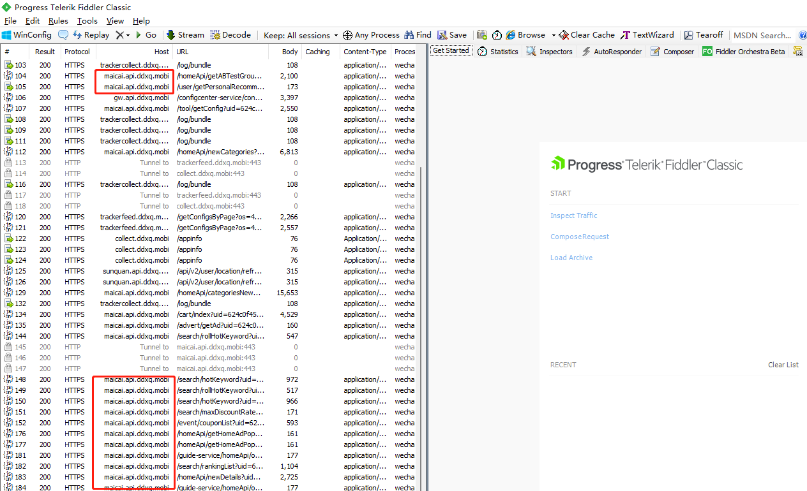
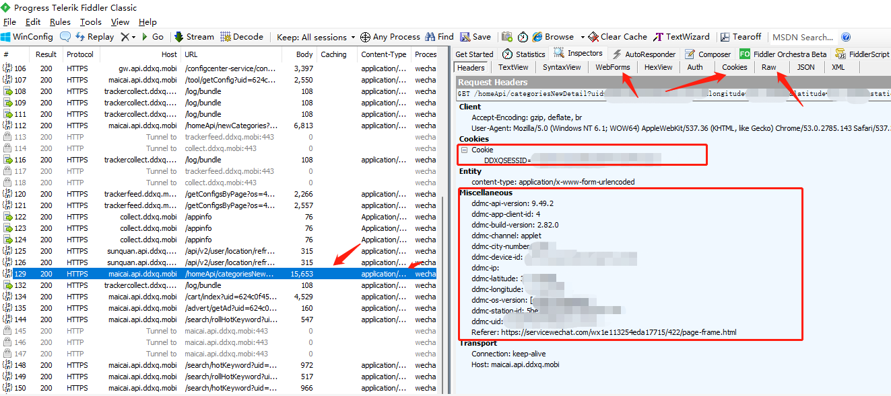
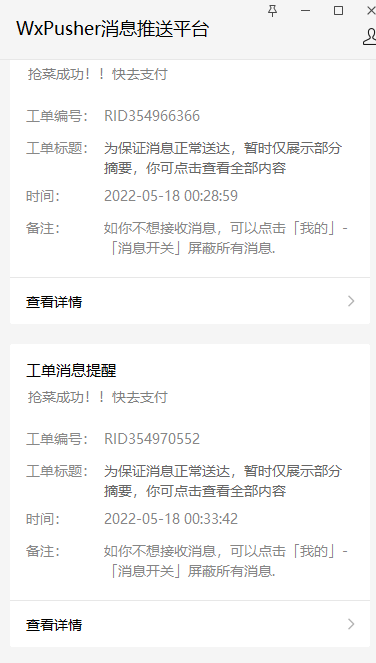

# 叮咚买菜小助手

## 前言
此程序集监控与自动抢购功能。

本项目纯属学习使用，不可用作商业行为，任何违法违规造成的问题与本人无关

## 使用必看

使用fidder等抓包工具，提取自己的cookie，uid即可。

为防止风控，每次使用前，核对`user.yaml`文件中参数是否和接口参数一致。

## 订阅

如果你使用微信通知，请关注`WxPusher`公众号，并订阅此链接

https://wxpusher.zjiecode.com/wxuser/?openId=orPQ806_O65ymisOhxCWuuaNV7vo#/

## 特点

纯自动化，挂着就行。
抢购成功后推送到你的微信。

## 使用教程

**使用fiddler抓包**

如果你不是从事计算机行业的人士，也许你对“抓包”这个词很陌生。凡是都有第一次，学着学着就会了

尽量在pc端（电脑上）抓包，别问为什么？为什么我懒得打字了...

**安装fiddler**

下载地址：https://516888.lanzoul.com/irivD031jsre

如果你不会安装...就一直点下一步（I agree、OK、Next）...

因为微信小程序的请求报文，都是https协议的。所以需要在fiddler里面稍加配置。

打开fiddler，上方的工具栏--Tools--Options--Https--打钩 Decrypt HTTPS traffic

遇到yes就点yes；遇到ok就点ok，遇到next就点next。

最后点击OK，保存生效。这样就可以抓Http的数据包了。

打开PC端的微信，然后打开叮咚买菜小程序。你就可以看到fiddler里面有一堆数据包呈现在你的眼中。

这类`*.maicai.api.ddxq.mobi`都是叮咚买菜的数据包，这里我就不教你怎么过滤（仅查看叮咚的数据包）了，想学的自己百度、谷歌。

这里你需要先在买菜小程序里面授权登录你的账号。然后找到在fiddler里面找到最新的数据包，点击选中。

在我标记的地方，找到需要配置的参数（不知道需要配置什么参数，就打开user.yaml里面看)

因为叮咚小程序目前所有的网络请求都是基于小程序云函数的，所以你抓不到https的数据包。

你可以抓支付宝，h5的包。自己修改user.yaml里面的内容，就可以使用了。

## 成功案例

## 结语

如果看完了这篇教程，你还是不会...那你不妨叫我好友（itestcoder），一杯咖啡~ **不接受任何无偿**...

最后，疫情早点结束！大家都不会饿肚子！
