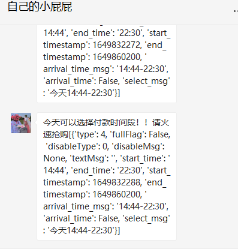

# 叮咚买菜小助手

## 前言
此程序旨在监听运力，用于捡漏，不涉及自动抢购。需要自动抢购，可以自己拓展完善。

本项目纯属学习使用，不可用作商业行为，任何违法违规造成的问题与本人无关

## 小白必看

如果你没有任何开发的基础，包括没有`python`环境。

仅仅需要打开目录`dist`下的main.exe使用即可。但是一定要配置dist目录下的`card.yml`和`user.yml`。

如果你有python基础，并且想二次开发本程序，则需要配置的是根目录下的`card.yml`和`user.yml`。

## 可能会发生的问题

如果程序报以下错误

```
IndexError：list index out of range
```

你只需要随便添加一个商品到购物车，就ok了。并且此操作不影响对运力的监控。

## 功能

① address_id和station_id获取

方便同学们获取address_id和station_id，防止填写错误而监听不到运力信息，以及配合其他抢菜程序的使用。

② 监控运力

早上6点、8点多的名额你抢不到，你或许可以选择捡漏。但是你不可能一天都爬在手机上盯着。
所以这个功能可以很大程度的节省你的时间。

## 特点

纯自动化，挂着就行。
有运力推送到你的微信。

## 使用教程

**使用fiddler抓包**

如果你不是从事计算机行业的人士，也许你对“抓包”这个词很陌生。凡是都有第一次，学着学着就会了

尽量在pc端（电脑上）抓包，别问为什么？为什么我懒得打字了...

**安装fiddler**

下载地址：https://516888.lanzoul.com/irivD031jsre

如果你不会安装...就一直点下一步（I agree、OK、Next）...

因为微信小程序的请求报文，都是https协议的。所以需要在fiddler里面稍加配置。

打开fiddler，上方的工具栏--Tools--Options--Https--打钩 Decrypt HTTPS traffic

遇到yes就点yes；遇到ok就点ok，遇到next就点next。

最后点击OK，保存生效。这样就可以抓Http的数据包了。

打开PC端的微信，然后打开叮咚买菜小程序。你就可以看到fiddler里面有一堆数据包呈现在你的眼中。


这类`*.maicai.api.ddxq.mobi`都是叮咚买菜的数据包，这里我就不教你怎么过滤（仅查看叮咚的数据包）了，想学的自己百度、谷歌。

这里你需要先在买菜小程序里面授权登录你的账号。然后找到在fiddler里面找到最新的数据包，点击选中。


在我标记的地方，找到需要配置的参数（不知道需要配置什么参数，就打开user.yml里面看）

也许这一系列操作下来，你都找不到`address_id`的值！不用担心，打开main.py，找到这行代码

```
# getValidAddress()
```

把前面的`#`，删掉。就是取消注释的意思，这行代码在程序运行中就会执行。

如果加上`#`，就是注释的意思。这行代码就不会被执行。

在你不知道address_id、station_id的情况下，你可以运行这行代码，获取后，粘贴到user.yml文件中。

一定要核对填写准确！

在运行监控运力的时候，需要先获取到购物车里面的商品，你不用担心商品失效...只要你购物车有商品就行。

```
# getCardMsg()
```

还是同上，去掉前面的`#`，就会读取购物车中商品，自动配置到card.yml文件中。

以上配置都走完后，你可以注释掉上面两行代码，就差开启运力监控了
 
```
# getMultiReserveTime()
```

注释掉前面的`#`，就启动运力监控。

这里监控到有运力后，会推送到你的微信。你一定会惊讶，怎么推送到你的微信。那当然是你和我成为微信好友，我给你发送微信消息，实现推送。

如果你不想加我好友，也可以把通知方式改成`音频播放通知`（需要编码基础），或者也可以改成其他的通知方式。

# 成功案例


# 结语

如果看完了这篇教程，你还是不会...那你不妨叫我好友（iamyangxuea），一杯咖啡~

最后，疫情早点结束！大家都不会饿肚子！